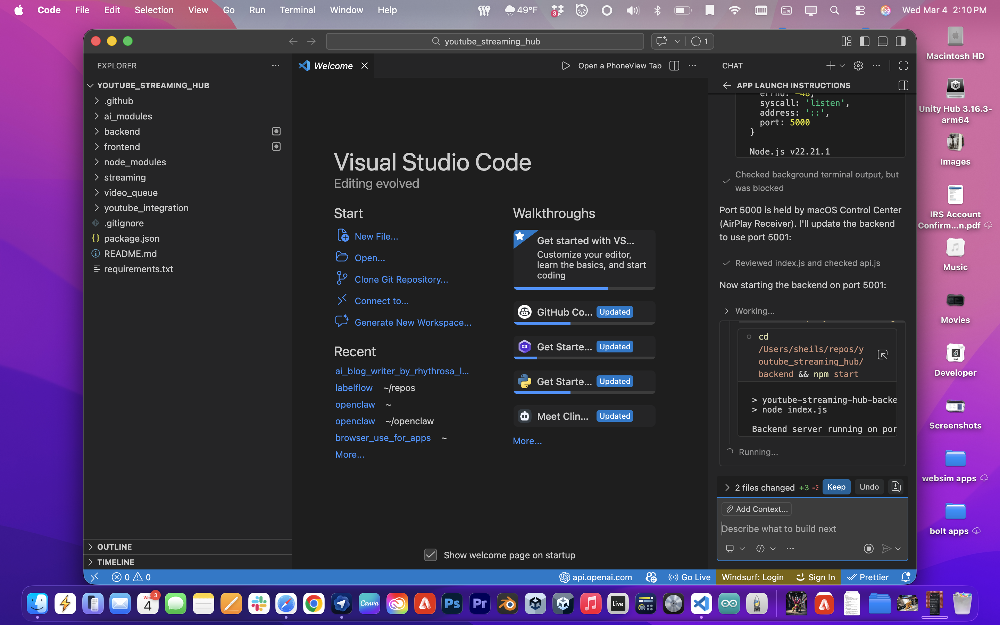

# ✍️ AI Blog Writer

> A fully featured, AI-powered browser-based blog writing studio — create, edit, publish, and share long-form content in seconds.

Built by **Rhythrosa Labs** on the [WebSim](https://websim.ai) platform. AI Blog Writer combines a rich-text editor, multiple AI writing tools, AI image generation, a community library, and PDF/HTML export in a single zero-setup web app.



---

## ✨ Features

### 🤖 AI Writing Assistant
| Feature | Description |
|---|---|
| **Generate Ideas** | Brainstorm 5 engaging, fully described blog post concepts at a click |
| **Suggest Titles** | Get 5 SEO-friendly, catchy title options for any topic |
| **Improve Selected Text** | Rewrite highlighted text with improved clarity, flow, and impact |
| **Expand Topic** | Turn a short topic into a complete, well-structured blog section |
| **Generate Full Blog** | Produce an entire 800 + word HTML-formatted blog post — including AI-generated images inserted at the right spots |
| **AI Chat Assistant** | Chat-based writing coach — ask questions, get suggestions, request rewrites in natural language |

### 🎨 Rich Text Editor
- **Formatting toolbar**: bold, italic, underline, bullet lists, numbered lists
- **Contenteditable canvas** — paste, type, drag-and-drop with live word & character count
- **Image insertion** — upload local images directly into the editor
- **Writing tone selector** — Professional · Casual · Formal · Creative · Persuasive

### 🖼️ AI Image Generation
- Generate contextually appropriate images from a topic or title
- Images are inserted inline at the cursor or at logical positions inside AI-generated posts
- No-text, high-quality visual output tailored for blog use

### 📖 Community Library
- All published blogs are stored in a real-time shared database visible to every user
- **Search** across titles and content
- **Sort** by Newest, Oldest, or Alphabetical
- **Upvote / Downvote** each post — scores update live for everyone
- **Author avatars** and usernames displayed on every card
- Click any card to open the full post in a clean reader view

### 📤 Export & Publish
| Action | Description |
|---|---|
| **Save Draft** | Persists the current post to `localStorage` — survives page refresh |
| **Download HTML** | Export a self-contained, styled HTML file |
| **Download PDF** | Multi-page PDF generated client-side via `html2canvas` + `jsPDF` |
| **Publish to Library** | Push the post to the shared community library (requires WebSim login) |

### 🔗 Sharing
- Each published post gets a shareable URL with the post ID in the query string
- Opening a shared link deep-links directly into the reader view for that post

---

## 🚀 Quick Start (WebSim)

AI Blog Writer is designed to run natively on [WebSim](https://websim.ai).

1. Go to **[websim.ai](https://websim.ai)** and sign in / create a free account.
2. Fork or open this project in a WebSim project space.
3. Click **Run** — the app is fully live with no configuration needed.

> **Why WebSim?**  
> The app uses WebSim's platform APIs (`window.websim`) for AI completions, image generation, file uploads, and real-time multi-user state. These APIs are injected automatically in the WebSim runtime and are not available in a plain browser tab.

---

## 🏃 Running Locally (UI preview only)

You can preview the HTML/CSS/layout without the AI features using any static file server:

```bash
# Python 3
python3 -m http.server 3000

# Node.js (npx)
npx serve .
```

Open `http://localhost:3000` in your browser. The editor, toolbar, and all views will render — AI calls and the community library will not function without the WebSim runtime.

---

## 🗂️ Project Structure

```
ai_blog_writer/
├── index.html          # App shell — markup, CDN imports, importmap
├── styles.css          # All styles (CSS variables, responsive layout)
│
├── app.js              # Root orchestrator — wires UIManager, DB, Editor, Library
├── ui.js               # UIManager — all DOM reads/writes, view switching
├── utils.js            # Pure utilities — stats, excerpt, formatting helpers
│
├── api.js              # ApiService — all WebSim AI requests (chat, image gen)
├── database.js         # DatabaseService — WebsimSocket CRUD + subscriptions
│
├── blog-editor.js      # BlogEditor — composes all editor sub-modules
├── editor-ai.js        # EditorAI — AI action handlers (ideas, titles, improve…)
├── chat-module.js      # EditorChat — real-time AI chat session
├── image-module.js     # EditorImages — local file image insertion
├── export-utils.js     # EditorExport — HTML download, PDF generation
├── publishing.js       # EditorPublishing — draft save, library publish
│
├── blog-library.js     # BlogLibrary — public feed, voting, blog reader
│
└── screenshots/        # UI screenshots for documentation
```

---

## 🛠️ Tech Stack

| Layer | Technology |
|---|---|
| Language | Vanilla JavaScript (ES Modules) |
| Markup | HTML5 (semantic, no framework) |
| Styling | CSS3 (custom properties, grid, flexbox) |
| AI — Text | WebSim `chat.completions` API |
| AI — Images | WebSim `imageGen` API |
| Real-time DB | [`@websim/websim-socket`](https://esm.websim.com/@websim/websim-socket) |
| File Uploads | WebSim `upload` API |
| PDF export | [`jsPDF`](https://github.com/parallax/jsPDF) + [`html2canvas`](https://html2canvas.hertzen.com/) |
| Icons | [Font Awesome 6](https://fontawesome.com/) |
| Fonts | [Google Fonts — Inter](https://fonts.google.com/specimen/Inter) |

---

## 🔒 Security Notes

- **No API keys are stored in the codebase.** All AI and database calls go through the WebSim platform runtime which handles auth server-side.
- **No secrets should ever be committed** to this repository. The `.gitignore` excludes `.env` files and common credential patterns.
- User-uploaded images are stored in WebSim's blob storage, not embedded as base64 data URIs.
- `localStorage` is used only for temporary draft persistence; no sensitive data is stored there.

---

## 📁 Data Model

### `blog_post`
| Field | Type | Description |
|---|---|---|
| `id` | `uuid` | Auto-generated unique identifier |
| `title` | `text` | Post headline |
| `content` | `text` | Full HTML body |
| `excerpt` | `text` | First 200 characters of plain text |
| `word_count` | `integer` | Computed word count at publish time |
| `author_username` | `text` | WebSim username |
| `author_id` | `text` | WebSim user ID |
| `created_at` | `timestamp` | Managed by WebsimSocket |

### `blog_vote`
| Field | Type | Description |
|---|---|---|
| `id` | `uuid` | Composite: `{user_id}-{blog_id}` (one vote per user/post) |
| `blog_id` | `uuid` | References `blog_post.id` |
| `vote_type` | `text` | `"upvote"` or `"downvote"` |

---

## 🤝 Contributing

Contributions are welcome! To propose a change:

1. Fork the repository
2. Create a feature branch: `git checkout -b feature/my-feature`
3. Commit your changes: `git commit -m "feat: describe the change"`
4. Push and open a Pull Request

Please ensure no API keys, tokens, or personal credentials are included in any commit.

---

## 📄 License

MIT License — see [LICENSE](LICENSE) for full text.

---

<p align="center">Made with ❤️ by <strong>Rhythrosa Labs</strong></p>
