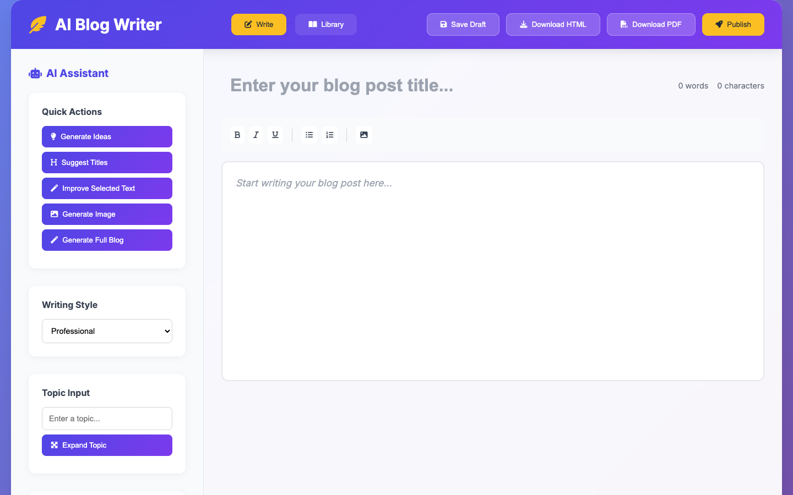

<div align="center">

# ✍️ AI Blog Writer

**A fully featured, AI-powered browser-based blog writing studio**


</div>

---

AI Blog Writer is a zero-setup, browser-based writing studio. It combines a rich-text editor, multiple AI writing tools, inline AI image generation, a live community library, and PDF/HTML export — all running in the browser with no backend required.

## ✨ Features

- **AI Writing Assistant** — generate ideas, suggest titles, expand topics, improve selected text, or generate full 800+ word posts
- **AI Chat Coach** — ask questions, request rewrites, get suggestions via a built-in chat interface
- **Rich Text Editor** — bold, italic, lists, image insertion, live word/character count, tone selector (Professional · Casual · Formal · Creative · Persuasive)
- **AI Image Generation** — DALL-E-powered images inserted inline at the right spots
- **Community Library** — all published posts are live and searchable; upvote/downvote in real time
- **Export** — download any post as PDF or HTML
- **Zero Setup** — open `index.html` in a browser and go

## 🚀 Quick Start

```bash
git clone https://github.com/RhythrosaLabs/ai-blog-writer.git
cd ai-blog-writer
# Open index.html in your browser — no build step needed
open index.html
```

Add your OpenAI API key in the settings panel when prompted.

## 🛠️ Tech Stack

- **Vanilla JavaScript** — no framework, no bundler
- **HTML5 + CSS3** — contenteditable editor, custom toolbar
- **OpenAI API** — GPT for writing, DALL-E for images
- **IndexedDB / localStorage** — client-side post storage

## 📸 Screenshot



## 🤝 Contributing

PRs welcome. Open an issue first for major changes.

## 📄 License

MIT

## 💛 Support

If this project helps you create, consider supporting development:

👉 [Donate via PayPal](https://paypal.me/noodlebake) — @noodlebake

---
<div align="center">Made with ❤️ by <a href="https://github.com/RhythrosaLabs">RhythrosaLabs</a></div>
